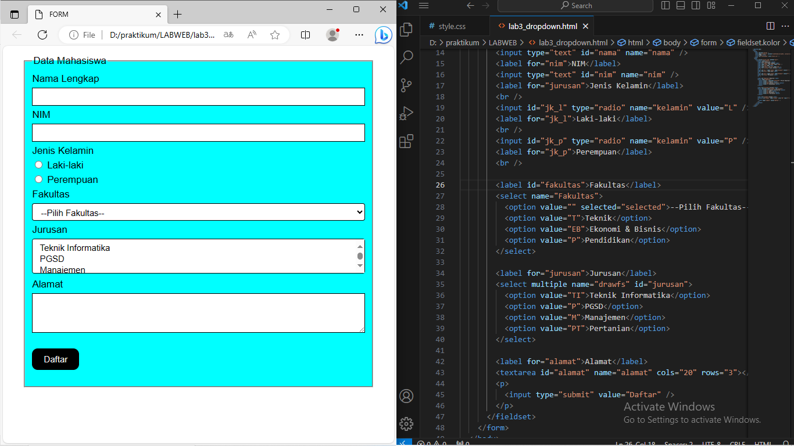

```
Nama : Muhammad Ryamziard R S
```

## TUGAS Pertemuan 4

### Buatlah form yang menampilkan dropdown menu dan listbox dengan multiple selection.
```
OUTPUT + CODE
```



## Praktikum 3

1. Buat order list


2. Buat unordered list


3. Buat Description list


4. Membuat Tabel


5. menggabungkan sel data


6. Buat Form


7. Buat style pada form


## Validasi File html

Validasi file html


#### Sekian Terimakasih
